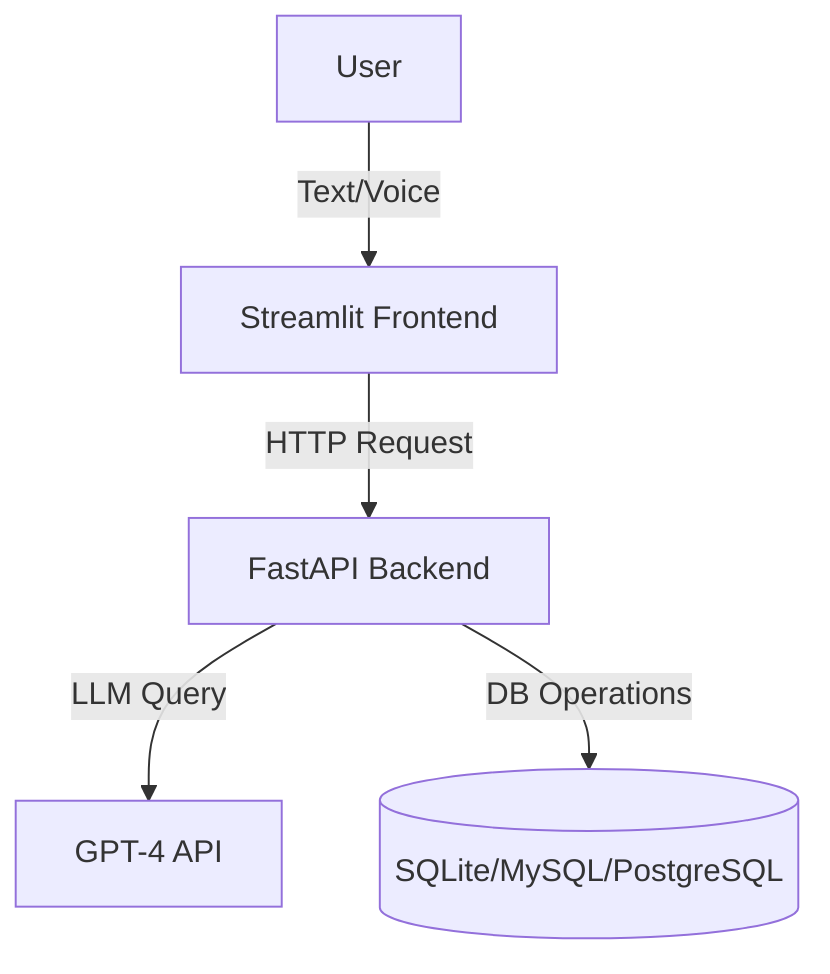

# 🏥 Healthcare-Assistant

**Healthcare-Assistant** is an AI-powered hospital appointment scheduling system built using **GPT-4**, **FastAPI**, and **Streamlit**. It supports both **text and voice-based interaction**, allowing users to easily book, cancel, or inquire about appointments through a conversational interface.

---

## 📋 Table of Contents

- [Features](#features)
- [Architecture](#architecture)
- [Prerequisites](#prerequisites)
- [Installation](#installation)
- [Usage](#usage)
- [Linux-Specific Setup](#linux-specific-setup)
- [Troubleshooting](#troubleshooting)

---

## ✨ Features

- 🧠 GPT-4 powered natural language understanding.
- 🎙️ Voice-to-text and text-to-speech capabilities.
- ⚡ FastAPI-based backend for high-performance REST APIs.
- 📊 Streamlit frontend for interactive user interface.
- 🔐 Secure OpenAI API integration.

---

## 🏗️ Architecture



---

## 🧰 Prerequisites

Ensure the following are installed:

- Python 3.12+
- `pip`
- Git
- OpenAI API key

Python Packages:
- `fastapi`
- `streamlit`
- `pyttsx3`, `gTTS` (TTS options)
- `speechrecognition`, `pyaudio` (STT options)
- `requests`, `uvicorn`, `python-dotenv`

Linux Audio Tools (if applicable):
- `espeak`
- `mpg321`

---

## ⚙️ Installation

### 1. Clone the Repository

```bash
git clone https://github.com/Ramakrishnan3118/Healthcare-Assistant.git
cd Healthcare-Assistant
```

### 2. Set Up Virtual Environment (Optional)

```bash
python3 -m venv venv
source venv/bin/activate  # Linux/macOS
```

### 3. Install Dependencies

```bash
pip install -r requirements.txt
```

### 4. Configure Environment Variables

in `.env` file in the root directory add GPT-4 API key:

```
OPENAI_API_KEY=your_openai_api_key_here
```

### 5. Install TTS Packages

Choose your preferred method:

- For **eSpeak**:

  ```bash
  sudo apt install espeak mpg321
  pip install pyttsx3
  ```

- For **gTTS**:

  ```bash
  pip install gTTS
  ```

---

## 🚀 Usage

### 1. Start the Backend (FastAPI)

```bash
uvicorn main:app --reload
```

Visit: [http://127.0.0.1:8000](http://127.0.0.1:8000)

### 2. Launch the Frontend (Streamlit)

In a new terminal:

```bash
streamlit run app.py
```

This will open the interface in your default browser.

---

## 🐧 Linux-Specific Setup

```bash
sudo apt install espeak mpg321
```

Ensure microphone access is enabled and functioning.

---

## 🛠️ Troubleshooting

- ✅ Verify `.env` contains the correct OpenAI key.
- ✅ Ensure `uvicorn` is serving the API at `localhost:8000`.
- ✅ Check the console for any Python or Streamlit errors.
- ✅ If voice features don’t work, confirm microphone and audio playback configurations.

---
